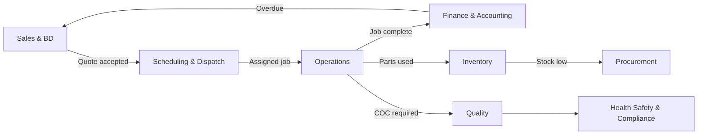

# TITAN Department Handoff Matrix

**Phase:** 13 — Corporate Department Operating Model  
**Company:** Young Guns Plumbing  

Handoffs are documented triggers and deliverables — not automated workflow stubs. Each maps to routes in `packages/shared/src/corporate-departments.ts`.

---

## Handoff register

| From | To | Trigger | Deliverable | Primary route |
|------|-----|---------|-------------|---------------|
| Executive & Strategy | Finance & Accounting | Cash or margin concern on dashboard | Receivables + cashflow review | `/finance/receivables` |
| Finance & Accounting | Sales & Business Development | Disputed invoice or quote mismatch | Sales confirms scope before credit note | `/finance/quotes` |
| Sales & Business Development | Scheduling & Dispatch | Quote accepted / job created | Scheduled job with assigned technician | `/scheduling` |
| Marketing & Growth | Sales & Business Development | Marketing-qualified lead captured | Lead with source attribution in CRM | `/leads` |
| Customer Experience | Operations | Service issue on active job | Job note; dispatch reassignment if needed | `/jobs` |
| Operations | Finance & Accounting | Job marked complete | Invoice draft or job finance link | `/finance/invoices` |
| Scheduling & Dispatch | Fleet & Assets | Technician needs vehicle swap | Updated vehicle assignment | `/fleet/vehicles` |
| Projects & Construction | Procurement | Project materials shortfall | PO or parts request | `/procurement/parts-requests` |
| Procurement | Inventory | PO received | Stock movement; updated on-hand qty | `/inventory/movements` |
| Inventory | Procurement | Stock below minimum | Parts request or PO draft | `/procurement/parts-requests` |
| Fleet & Assets | Scheduling & Dispatch | Vehicle unavailable | Revised dispatch without affected vehicle | `/scheduling` |
| Quality | Health Safety & Compliance | Regulated install completed | COC and compliance docs in job pack | `/documents/job-packs` |
| Health Safety & Compliance | Legal Risk & Internal Control | Regulatory inquiry or incident | Document bundle and timeline | `/documents/compliance` |
| Legal Risk & Internal Control | Administration | Policy update approved | Published team policy | `/settings/documents-records` |
| IT & Cybersecurity | Finance & Accounting | Xero sync failure | Finance notified; read-only until resolved | `/integrations` |
| Data & Analytics | Executive & Strategy | Monthly business review | Analytics snapshot for owner session | `/analytics` |
| Administration | HR & Workforce | New hire onboarded | User account with correct role + mobile | `/settings/team` |
| AURA Digital Workforce | Operations | Approved dispatch recommendation | Updated schedule or job assignment | `/scheduling` |

---

## Critical path (job → cash)

---

## SLA expectations (operating model — not system timers)

| Handoff | Target | Owner |
|---------|--------|-------|
| Quote accepted → scheduled | Same business day | Dispatcher |
| Job complete → invoice draft | Within 24h | Accountant |
| Parts request → PO | Within 4h (emergency) | Procurement |
| Customer message → first response | Within 2h business | CX / Dispatcher |
| Incident → Owner notified | Within 24h | H&S → Legal |

---

## Empty handoff queues

When no jobs, leads, or messages exist on staging, downstream departments correctly show **empty Today queues**. Handoff matrix still applies when triggers occur in production operations.
