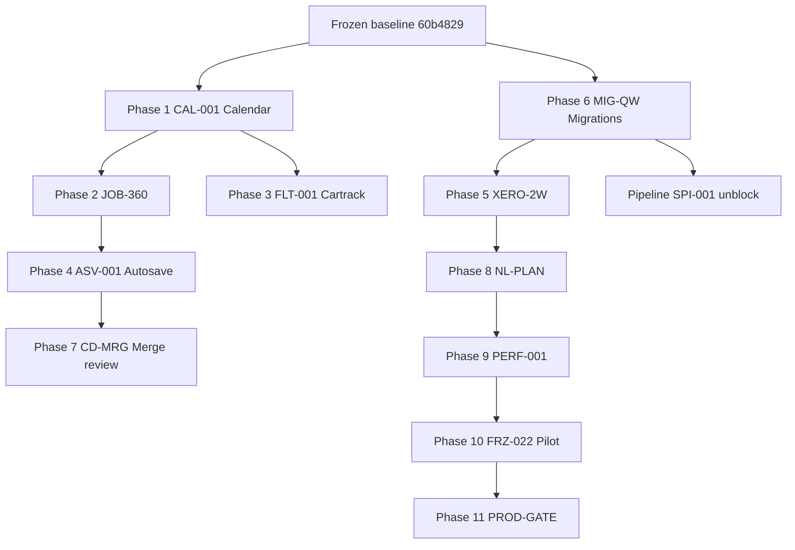

# TITAN Next Implementation Stage Plan

**Plan only — no implementation in FREEZE-001.**  
**Date:** 2026-08-01  
**Frozen baseline:** `60b4829` on `cursor/titan-frozen-scope-completion`  
**Authoritative freeze:** `TITAN_STAGING_BASELINE_FREEZE.md`  
**Sources:** `TITAN_MASTER_COMPLETION_REPORT.md` deferrals, `TITAN_AUTO_WORK_PIPELINE.md`, `TITAN_GAP_BACKLOG.md`

---

## Principles

1. **Staging only** until pilot FRZ-022 and production gates pass.  
2. **One active phase at a time** — complete staging verify before next phase.  
3. **Owner gates** explicit at phases involving writes, migrations, pilot sign-off, or production.  
4. **No merge to main** without future explicit Owner approval.  
5. **Quiescent window** required before migrations 0107, 0109, 0110 (no active Xero import batches).

---

## Phase overview

| Phase | ID | Focus | Owner gate | Staging only | Est. scope |
|-------|-----|-------|------------|--------------|------------|
| 1 | CAL-001 | Scheduling calendar (day/week/month, drag-drop) | No | Yes | **Large** (2–3 sprints) |
| 2 | JOB-360 | Full job file 360 per visit | No | Yes | **Large** (2 sprints) |
| 3 | FLT-001 | Fleet/Cartrack live when connected | Credentials | Yes | **Medium** (1–2 sprints) |
| 4 | ASV-001 | Remaining autosave modules | No | Yes | **Medium** (1 sprint) |
| 5 | XERO-2W | Xero two-way sync (writes) | **Yes — writes** | Yes | **Large** (2 sprints) |
| 6 | MIG-QW | Pending migrations 0107, 0109, 0110 | **Yes — migration window** | Yes | **Small** (0.5 sprint) |
| 7 | CD-MRG | Duplicate customer merge review | **Yes — keanu queue** | Yes | **Small** (0.5 sprint) |
| 8 | NL-PLAN | NL today's plan parse | No | Yes | **Medium** (1 sprint) |
| 9 | PERF-001 | Authenticated performance profiling | Session/creds | Yes | **Small** (0.5 sprint) |
| 10 | FRZ-022 | Pilot final acceptance | **Yes — pilot sign-off** | Yes | **Medium** (1 sprint) |
| 11 | PROD-GATE | Production deploy | **Yes — explicit Owner only** | No | **Small** (checklist sprint) |

---

## Phase 1 — CAL-001: Scheduling calendar

**Goal:** Full office scheduling calendar with day/week/month views and drag-drop assignment.

### Dependencies

- Frozen baseline `60b4829` deployed on staging
- Existing scheduling routes + Live Dispatch nav (`FRZ-006` partial)
- Phase 6 crew assignment API (`0096+`) already staging-verified

### Owner gates

- None for UI/API development on staging
- Owner click-path verify before marking FRZ-006 calendar complete

### Staging-only

Yes — no production until PROD-GATE.

### Estimated scope

**Large.** Calendar component (day/week/month), drag-drop event reschedule, crew/vehicle assignment from calendar, query invalidation on schedule changes, RBAC (Owner/Dispatch write, read-only for others), staging E2E for create/move/assign. Aligns with `TITAN_MASTER_COMPLETION_REPORT.md` §9 deferral and `FRZ-006` calendar labels gap.

### Deliverables

- [ ] Calendar views wired to existing schedule API
- [ ] Drag-drop with optimistic update + rollback
- [ ] Staging E2E evidence JSON
- [ ] Update `TITAN_ACCEPTANCE_REGISTER.md` FRZ-006 classification

---

## Phase 2 — JOB-360: Full job file 360 per visit

**Goal:** Complete per-visit job file: evidence, materials, timeline, finance strip, documents, immutable snapshot UX.

### Dependencies

- Phase 1 optional (schedule context helps but not blocking)
- UX-B field execution baseline (staging verified)
- Document upload binary evidence (UX-B closure)

### Owner gates

- None for staging build
- Owner verify immutable snapshot + verified-update checkboxes on real test job

### Staging-only

Yes.

### Estimated scope

**Large.** Job detail 360 layout, per-visit tabs (execution, materials, docs, finance, timeline), link to job pack/COC, mobile parity for key read paths. Deferral from `TITAN_MASTER_COMPLETION_REPORT.md` §6.

### Deliverables

- [ ] Job 360 page composition
- [ ] Visit-scoped evidence and materials rollup
- [ ] Staging click-path on STAGING-P* test job
- [ ] Gap closure: OPS-005, UX-017 remainder

---

## Phase 3 — FLT-001: Fleet/Cartrack live when connected

**Goal:** Live fleet map and vehicle status when Cartrack credentials connected; honest fallback when not.

### Dependencies

- Cartrack API credentials (Owner/provider)
- `FLT-002`, `FLT-008` gap backlog — honest Maps surfaces already closed (UX-I)
- Settings scaffold exists

### Owner gates

- **Yes** — Cartrack credential provision and connect on staging
- No fake live map when disconnected (binding rule criterion 7)

### Staging-only

Yes until PROD-GATE.

### Estimated scope

**Medium.** Connect flow, live vehicle pins, status polling, dispatch map panel on dashboard (`FRZ-004` deferred live map). Drivers/geofences remain future sub-phase.

### Deliverables

- [ ] Cartrack connect + health in `TITAN_PROVIDER_STATE_REGISTER.md`
- [ ] Live map on dispatch/dashboard when connected
- [ ] Truthful disconnected state when credentials absent

---

## Phase 4 — ASV-001: Remaining autosave modules

**Goal:** Extend `AutosaveIndicator` + draft shell pattern to customer, PO, documents, marketing forms.

### Dependencies

- Invoice autosave pattern from `60b4829` / Phase 1 polish
- `useFormDraftShell` + `PageHeader` guard navigation

### Owner gates

- None

### Staging-only

Yes.

### Estimated scope

**Medium.** Wire draft/autosave on 4 module create/edit flows; debounced API where missing; consistent Saved/Saving/Failed UX.

### Deliverables

- [ ] Customer create/edit autosave
- [ ] PO create/edit autosave
- [ ] Document metadata autosave
- [ ] Marketing campaign draft autosave (execute still gated)

---

## Phase 5 — XERO-2W: Xero two-way sync (writes)

**Goal:** Controlled Xero write path with Owner approval gate — invoice push, payment sync, official Xero numbers.

### Dependencies

- Phase 6 migrations (`0109` scaffolding) applied first OR in parallel after quiescent window
- Xero import GO (`TITAN_AUTO_WORK_PIPELINE.md` Phase 2)
- `TITAN_XERO_TWO_WAY_SYNC.md`, `TITAN_XERO_TWO_WAY_VERIFY_QUEUE.md`
- Financial display fix at `60b4829` (read path truthful)

### Owner gates

- **Yes — mandatory** for any live Xero write on staging org
- **Yes — mandatory** for production Xero writes
- Verify queue sign-off per FIN-005/FIN-007

### Staging-only

Yes until Owner approves production org writes.

### Estimated scope

**Large.** Apply 0109, write approval workflow UI, push invoice/payment, conflict metadata, staging verify queue execution, no silent writes.

### Deliverables

- [ ] Migration 0109 applied (see Phase 6)
- [ ] Write approval gate E2E on staging Xero org
- [ ] `TITAN_XERO_TWO_WAY_VERIFY_QUEUE.md` items closed
- [ ] Update FRZ-010, FRZ-018 classification

---

## Phase 6 — MIG-QW: Pending migrations quiescent window

**Goal:** Apply migrations 0107, 0109, 0110 on staging during Xero import quiescent window.

### Dependencies

- **No active Xero import batches** (`TITAN_CURRENT_STATE_RECONCILIATION.md`)
- Disposable DB verify already PASS for 0107 (see test evidence index)
- SPI-001 code at `0b6b911` blocked on 0110

### Owner gates

- **Yes — migration window approval** — Owner confirms import idle before apply
- No apply during active `integration_sync_jobs` batches

### Staging-only

Yes (production migrations separate approval).

### Estimated scope

**Small.** Three migration applies + journal evidence + row-count probes.

| Migration | Purpose |
|-----------|---------|
| `0107_whatsapp_contact_enrichment` | COM-013 contact sources + match reviews |
| `0109_xero_two_way_sync_scaffolding` | Write approvals + conflict metadata |
| `0110_supplier_price_intelligence` | SPI-001 tables |

### Deliverables

- [ ] Quiescent window evidence JSON
- [ ] Staging journal updated; diagnostic row-count files
- [ ] Unblock pipeline Phases 3–5 (SPI, Xero 2W)

---

## Phase 7 — CD-MRG: Duplicate customer merge review

**Goal:** Owner queue for duplicate customer review — no auto-merge.

### Dependencies

- Customer value classification (`182` probe, `211-duplicate-customer-review-queue.json`)
- Staging probe: 1 duplicate name group, 18 keanu matches queued

### Owner gates

- **Yes — keanu queue** — Owner reviews and approves each merge candidate
- No silent auto-merge (binding rule criterion 1)

### Staging-only

Yes.

### Estimated scope

**Small.** Review queue UI/API, side-by-side compare, explicit merge action with audit log, staging test on marked duplicates only.

### Deliverables

- [ ] Merge review queue for Owner role
- [ ] Audit trail on merge
- [ ] Close CD-002–004 partial gaps where applicable

---

## Phase 8 — NL-PLAN: NL today's plan parse

**Goal:** Natural-language input to parse Owner priorities into today's plan items.

### Dependencies

- Business Rules + Today's Plan foundation (`0114`–`0115`, `TITAN_BUSINESS_RULES_AND_DAY_PLAN.md`)
- AURA context injection for active rules
- OpenAI provider configured on staging (FRZ-015 GO)

### Owner gates

- No auto-pay, no auto-send (existing rule enforcement)
- Owner confirms parsed items before persist (suggest → approve pattern)

### Staging-only

Yes.

### Estimated scope

**Medium.** NL parser endpoint, structured output → `company_day_plans` items, UI on `/aura/todays-plan`, fail-loud on parse errors.

### Deliverables

- [ ] `POST /todays-plan/parse` (or AURA tool) with approval step
- [ ] Staging verify with sample Owner utterances
- [ ] No silent plan mutations

---

## Phase 9 — PERF-001: Authenticated performance profiling

**Goal:** Measure authenticated list API and app load performance on staging; close `TITAN_PERFORMANCE_GAP_BACKLOG.md` high-impact items.

### Dependencies

- Staging login session (Owner-provided or CI secret)
- Baseline from `TITAN_PERFORMANCE_BASELINE.md`

### Owner gates

- **Yes — session/credentials** for authenticated probes if not automatable

### Staging-only

Yes.

### Estimated scope

**Small.** Server-Timing on `/crm/customers`, `/jobs`, `/finance/invoices`; bundle analyzer pass; document findings; optional virtualization ticket if row counts >100.

### Deliverables

- [ ] Authenticated timing evidence JSON
- [ ] Updated `TITAN_PERFORMANCE_GAP_BACKLOG.md`
- [ ] Infra recommendations (keep-warm, region) documented separately

---

## Phase 10 — FRZ-022: Pilot final acceptance

**Goal:** Internal pilot milestone — Young Guns internal crew on staging with approved limits.

### Dependencies

- Phases 1–9 materially complete or explicitly waived by Owner
- `TITAN_PILOT_READINESS_REPORT.md` gates green
- Operational chain E2E re-run on frozen baseline deploy
- Provider minimums: AURA, Xero read, one comms channel, Cartrack or honest fallback

### Owner gates

- **Yes — pilot sign-off** (FRZ-022)
- Approved pilot limits enforced

### Staging-only

Yes — pilot runs on staging URLs only.

### Estimated scope

**Medium.** Full chain click-path, security matrix staging probe, financial read verify, pilot limit enforcement, sign-off document update.

### Deliverables

- [ ] Pilot acceptance checklist complete
- [ ] `TITAN_PILOT_READINESS_REPORT.md` verdict → PILOT-READY (conditional)
- [ ] FRZ-022 → Verified complete (staging)

---

## Phase 11 — PROD-GATE: Production deploy

**Goal:** Controlled production deploy with explicit Owner-only approval.

### Dependencies

- FRZ-022 pilot acceptance (or Owner waiver)
- `TITAN_PRODUCTION_DEPLOYMENT_CHECKLIST.md` complete
- Production migration approval (`0094`–`0104` already on prod journal 104; newer migrations gated)
- Backup + rollback plan current

### Owner gates

- **Yes — explicit Owner only** — no autonomous production deploy
- Separate approval from staging freeze

### Staging-only

No — this phase is production only after all prior gates.

### Estimated scope

**Small.** Checklist execution, deploy window, smoke, rollback drill reference.

### Deliverables

- [ ] Owner-signed production deploy approval record
- [ ] `TITAN_FINAL_LAUNCH_REPORT.md` update
- [ ] FRZ-023 progress toward launch acceptance

---

## Sequencing diagram

**Recommended start order:** Phase 6 (when quiescent) in parallel with Phase 1; Phase 3 when credentials available; Phase 5 after Phase 6.

---

## Pipeline alignment (`TITAN_AUTO_WORK_PIPELINE.md`)

| Pipeline phase | Maps to next-stage plan |
|----------------|-------------------------|
| Phase 2 Xero GO | Prerequisite for Phase 5; monitor during Phase 1 |
| Phase 3 SPI-001 | Unblocked by Phase 6 (`0110`) |
| Phase 6 JOB-DEL-001 | Can run after Xero GO; parallel to Phase 2 if migration window clear |
| Phase 7 PRN-001 | After JOB-DEL; not in top-level deferrals but in pipeline |
| Phase 10 PERF-001 | Phase 9 this plan |
| Phase 15 FRZ-022 | Phase 10 this plan |

---

## Next safe gate for Owner

**Immediate next action (no code):** Owner confirms Phase 1 (calendar) as first implementation priority OR approves Phase 6 migration window when Xero import is quiescent.

**Before any production work:** Explicit PROD-GATE approval only — staging freeze at `60b4829` does not authorize production.

---

**This plan is documentation only.** Implementation begins only after Owner selects starting phase post-freeze.
